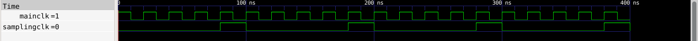
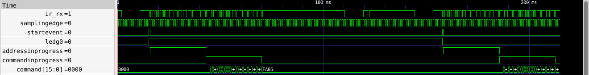
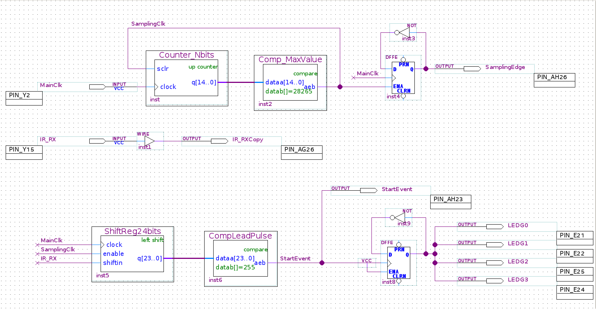
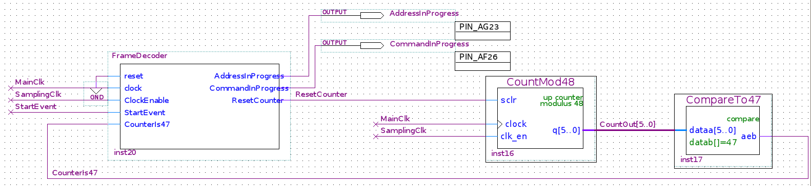
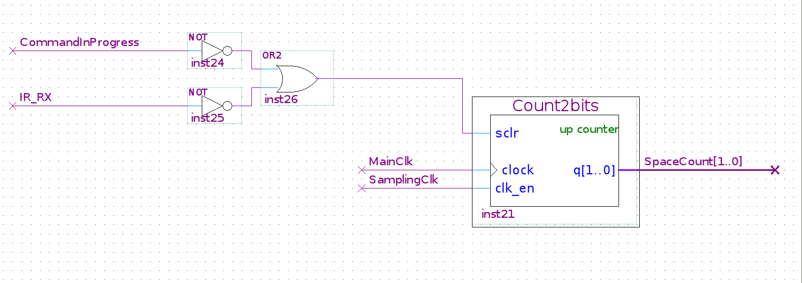
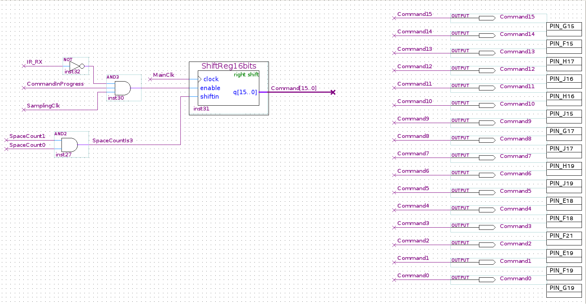
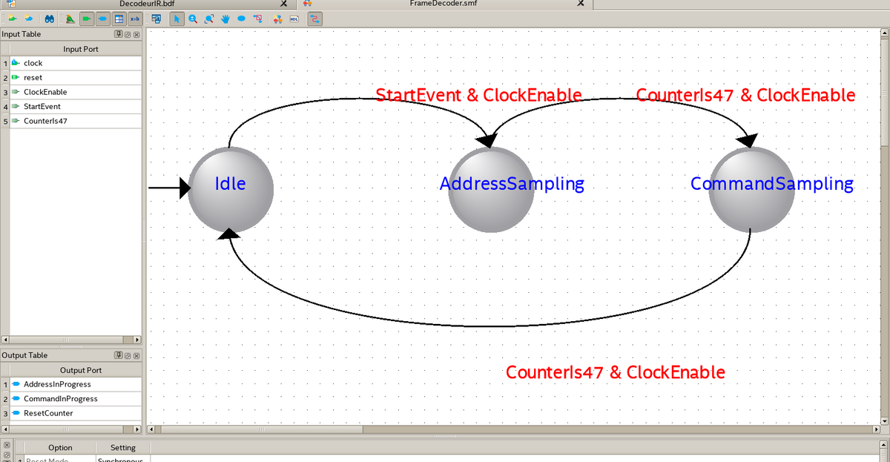

# tp fpga : décodeur de télécommande infrarouge (junia isen)

projet quartus complet du tp "fpga - field programmable gate array" : la carte de2-115 décode le message nec envoyé par la télécommande ir et affiche le code de la touche sur les leds.

tout est fait comme dans le sujet (parties 3 à 6) : mêmes composants, mêmes noms, mêmes pattes, même schéma. les parties optionnelles (6.4 et 6.5, afficheurs 7 segments) ne sont pas faites.

## ce qu'il faut

- quartus prime lite **19.1** (ou 18.1) pour linux, avec le support **cyclone iv** et modelsim (voir le pdf d'installation)
- la carte terasic de2-115 + son câble usb + la télécommande

## lancer le tp (une seule commande)

```bash
git clone https://github.com/tilouc/tp-electronique-numerique.git
cd tp-electronique-numerique
./run.sh
```

`./run.sh` trouve quartus tout seul (dans `~/intelFPGA_lite`, `~/altera_lite`, `/opt/...`) et programme le fpga avec le fichier déjà compilé `DecodeurIR/output_files/DecodeurIR.sof`.

avant de lancer :
1. branche le câble usb sur le port **usb blaster** de la carte (à gauche)
2. allume la carte (bouton rouge)
3. le switch **run/prog** doit être sur **run**

la première fois, si linux bloque l'accès au câble, le script te demande ton mot de passe (sudo) pour autoriser l'usb-blaster, puis programme la carte.

## ce que tu dois voir sur la carte

appuie sur une touche de la télécommande en visant le récepteur ir :

| partie du tp | résultat |
|---|---|
| 4 - détection du préambule | les 4 leds vertes `LEDG0..3` changent d'état à chaque appui |
| 6 - affichage de la commande | les leds rouges `LEDR7..0` affichent le code de la touche, `LEDR15..8` son complément |

exemples : touche `5` → `LEDR7..0` = `0000 0101` (0x05), touche `A` → `0000 1111` (0x0F), touche `0` → `0000 0000`.

si une touche est mal lue de temps en temps, rappuie : c'est la limite du principe du tp (un seul échantillon par "burst", cf. remarque 1 page 12).

## oscilloscope (connecteur 40 broches gpio)

| signal | patte | partie |
|---|---|---|
| `SamplingEdge` (instants d'échantillonnage, bascule t) | AH26 | 3.3 |
| `IR_RXCopy` (message de la télécommande) | AG26 | 3.3 |
| `StartEvent` (préambule détecté) | AH23 | 4 |
| `AddressInProgress` | AG23 | 5.6 |
| `CommandInProgress` | AF26 | 5.6 |

## les autres commandes

```bash
./run.sh compiler      # recompile le projet (après une modif) puis programme la carte
./run.sh ouvrir        # ouvre le projet dans quartus (schéma, machine d'états)
./run.sh simulation3   # simulation du paragraphe 3.2
./run.sh simulation    # simulation complète (messages ir simulés)
./run.sh usb           # autorise l'accès à l'usb-blaster (normalement automatique)
```

### simulations

les simulations s'ouvrent dans modelsim (installé avec quartus). si modelsim ne se lance pas (fréquent avec la version 19.1 sur linux mint récent), le script passe tout seul par **ghdl + gtkwave** (il les installe avec `sudo apt` si besoin) : même circuit, mêmes résultats.

- `simulation3` : comparateur réglé sur 4 → un cycle complet = 5 × 20 ns. on voit `MainClk` et `SamplingClk` comme sur la figure page 10 :



- `simulation` : le banc de test envoie la touche `5`, un code répétitif puis la touche `A`, et vérifie tout seul le résultat (comme l'oscillo page 24) :



dans la console tu dois lire :

```
OK touche 5 : Command = 0xFA05  (commande 0x05)
OK code repetitif : Command = 0xFA05  (commande 0x05)
OK touche A : Command = 0xF00F  (commande 0x0F)
FIN DE SIMULATION
```

(environ 215 ms simulées : compte 1 à 3 minutes.)

## contenu du projet (`DecodeurIR/`)

| fichier | partie du tp |
|---|---|
| `DecodeurIR.bdf` | le schéma principal (tout le tp est dedans) |
| `Counter_Nbits` (15 bits, sclr) + `Comp_MaxValue` (= 28265) | 3.1 / 3.3 - fréquence d'échantillonnage |
| `ShiftReg24bits` (left shift) + `CompLeadPulse` (= 255) | 4 - détection du préambule |
| `CountMod48` + `CompareTo47` | 5.2 / 5.3 |
| `FrameDecoder.smf` → `FrameDecoder.vhd` | 5.4 - machine d'états (idle, addresssampling, commandsampling) |
| `Count2bits` + `ShiftReg16bits` (right shift) | 6.1 / 6.2 - décodage et enregistrement de la commande |
| `DecodeurIR.qsf` | projet : ep4ce115f29c7, modelsim-altera vhdl, toutes les pattes |
| `simulation/` | bancs de test et scripts modelsim |

les composants ont été générés avec l'ip catalog de quartus 19.1 (fichiers `.vhd`, `.bsf`, `.cmp`, `.qip`) et la machine d'états avec le state machine wizard, comme demandé dans le sujet.

## valeurs à retenir pour le compte rendu

- r = 562,5 µs / 20 ns = **28125** → le compteur compte de 0 à r-1 = **28124**
- n = **15 bits** (2^15 - 1 = 32767 ≥ 28124)
- r-1 augmenté de 0,5 % (remarque 1 page 12) : 28124 × 1,005 ≈ **28265** (valeur utilisée dans le projet)
- préambule reçu (récepteur actif à l'état bas) : 16 × '0' puis 8 × '1' = `0000 0000 0000 0000 1111 1111` = **255**
- adresse ou commande + complément = 8 '1' (4 bursts) + 8 '0' (2 bursts) = **48 échantillons** → comparateur à **47**
- registre 16 bits en right shift : le lsb (envoyé en premier) finit dans `Command[0]` → `Command[7..0]` = commande, `Command[15..8]` = son complément
- ressources utilisées : 88 cellules logiques sur 114 480 (< 1 %)

## captures du schéma dans quartus

| | |
|---|---|
| parties 3 et 4 (pages 9, 10, 11, 16) |  |
| partie 5 (page 23) |  |
| partie 6.1 (page 26) |  |
| parties 6.2 et 6.3 (page 27) |  |
| machine d'états (page 23) |  |

## dépannage

- **"quartus introuvable"** : `export QUARTUS_ROOTDIR=$HOME/intelFPGA_lite/19.1/quartus` puis relance `./run.sh`
- **"aucun câble usb-blaster détecté"** : vérifie le câble (port usb blaster), que la carte est allumée et sur run, puis `./run.sh usb` et débranche / rebranche le câble
- **modelsim ne se lance pas** : pas grave, `./run.sh simulation` bascule sur ghdl + gtkwave. pour forcer ghdl directement : `./run.sh simulation ghdl`
- **version de quartus plus récente que 19.1** : le projet s'ouvre et compile pareil (si quartus propose de mettre à jour le projet, accepte). questa (le remplaçant de modelsim) demande une licence gratuite intel, sinon ghdl prend le relais.
