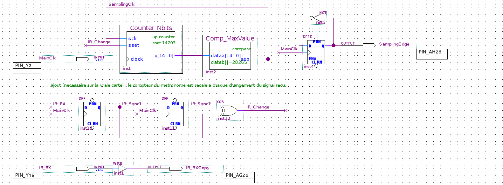
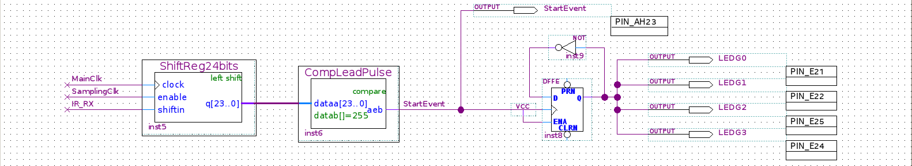

# tp fpga : décodeur de télécommande infrarouge (junia isen)

ce projet, c'est le tp "fpga" fait en entier dans quartus (parties 3 à 6 du sujet). la carte de2-115 reçoit le signal de la télécommande, le décode, et affiche sur des leds le code de la touche appuyée.

les parties optionnelles (6.4 et 6.5 : afficheurs 7 segments, affichage de l'adresse) ne sont pas faites.

**un seul ajout par rapport au pdf** : sur la vraie carte, la partie 6 ne marchait pas (le code des touches était mal lu). on a donc ajouté un petit montage de 3 blocs qui **recale le métronome** à chaque changement du signal reçu (expliqué dans la section 4, juste après la partie 3). tout le reste est exactement comme dans le pdf. la version sans cet ajout, identique au pdf, est gardée dans la branche `version-pdf` du dépôt.

---

## 1. lancer le projet

### ce qu'il faut

- quartus prime lite **19.1** pour linux, avec le support **cyclone iv** et modelsim (voir le pdf d'installation)
- la carte de2-115, son câble usb et la télécommande

### les 3 commandes

```bash
git clone https://github.com/tilouc/tp-electronique-numerique.git
cd tp-electronique-numerique
./run.sh
```

`./run.sh` trouve quartus tout seul et envoie le circuit déjà prêt dans la carte (fichier `DecodeurIR/output_files/DecodeurIR.sof`).

avant de lancer :
1. branche le câble usb sur le port **usb blaster** de la carte (à gauche)
2. allume la carte (bouton rouge)
3. mets le switch **run/prog** sur **run**

la première fois, linux peut bloquer l'accès au câble : le script te demande alors ton mot de passe pour l'autoriser, puis il programme la carte.

### ce que tu dois voir

la carte a 18 leds rouges (`LEDR0` à `LEDR17`) et 9 leds vertes (`LEDG0` à `LEDG8`). leur nom est écrit sur la carte à côté de chaque led. appuie sur une touche en visant le récepteur infrarouge :

- les 4 leds vertes `LEDG0` à `LEDG3` s'allument ou s'éteignent **toutes ensemble** à chaque appui
- les leds rouges `LEDR0` à `LEDR7` affichent le code de la touche en binaire (`LEDR0` = le bit de droite)
- les leds rouges `LEDR8` à `LEDR15` affichent l'inverse de ce code
- `LEDR16` et `LEDR17` ne servent pas : elles restent éteintes, ou à peine allumées (leurs pattes ne sont pas reliées au circuit, comme celles de `LEDG4` à `LEDG8`)

exemples (led allumée = 1) :

| touche | `LEDR7` ... `LEDR0` | code |
|---|---|---|
| `0` | `0000 0000` | `0x00` |
| `5` | `0000 0101` | `0x05` |
| `A` | `0000 1111` | `0x0F` |

les codes sont fixés par le fabricant de la télécommande (tableau page 17 du pdf) : la touche `A` donne `0x0F`, ce n'est pas une erreur.

si une touche est mal lue (ça doit rester rare), rappuie : explication dans la section 9.

**si tu avais déjà téléchargé le projet avant l'ajout** : dans le dossier, tape `git pull` pour récupérer la nouvelle version, puis `./run.sh` pour reprogrammer la carte.

---

## 2. avant de commencer : les mots à connaître

- **fpga** : une puce "vierge" qui contient des milliers de petites briques logiques (portes, bascules). on ne lui écrit pas un programme qui s'exécute ligne par ligne comme en c ou en python : **on lui dessine un circuit**, et la puce se câble elle-même pour devenir ce circuit.
- **quartus** : le logiciel où on dessine ce circuit (le **schéma**). **compiler**, c'est quand quartus transforme le schéma en fichier `.sof` qu'on envoie dans la puce.
- **horloge** : un signal qui fait 0, 1, 0, 1... très régulièrement. sur la carte, elle bat à **50 mégahertz** (50 millions de fois par seconde), donc une période dure **20 ns** (nanosecondes). dans le schéma elle s'appelle `MainClk` et elle entre dans le fpga par la patte `Y2`. presque tous les blocs qui ont une mémoire (compteurs, registres, bascules, machine d'états) reçoivent cette horloge : ils ne peuvent changer qu'au moment d'un coup d'horloge, et seulement s'ils y sont autorisés (voir juste en dessous).
- **entrée d'autorisation** (appelée `ENA`, `enable`, `clk_en` ou `ClockEnable` selon les blocs) : un bloc qui reçoit l'horloge ne fait quelque chose que si son entrée d'autorisation vaut 1. c'est l'astuce de tout le tp : ces blocs reçoivent l'horloge rapide (`MainClk`) mais ne sont autorisés à avancer qu'une fois par burst (l'unité de temps de la télécommande, 562,5 µs, expliquée en section 3). le seul compteur qui avance à chaque coup, toutes les 20 ns, c'est celui du métronome (`Counter_Nbits`) : c'est justement lui qui mesure la durée d'un burst.
- **compteur** : un bloc qui ajoute 1 à chaque coup d'horloge autorisé. son entrée `sclr` le remet à 0 au coup d'horloge autorisé suivant (pour `Counter_Nbits`, qui n'a pas d'entrée d'autorisation, c'est simplement le coup d'horloge suivant). `Counter_Nbits` a aussi une entrée `sset` (c'est l'ajout) : elle le met à une valeur fixée à l'avance au lieu de 0.
- **comparateur** : un bloc qui sort 1 quand le nombre qu'il reçoit est égal à une valeur fixée (sa sortie s'appelle `aeb`, "a égal b").
- **registre à décalage** : une rangée de cases mémoire (une case = un bit). à chaque coup d'horloge autorisé, toutes les cases se décalent d'un cran, une nouvelle valeur entre d'un côté et la plus vieille sort de l'autre. ça sert à garder en mémoire les dernières valeurs reçues.
- **bascule** (`DFFE`) : une case mémoire d'un seul bit. une **bascule t**, c'est une bascule dont l'entrée reçoit l'inverse de sa propre sortie (via une porte `NOT`) : à chaque fois qu'elle est activée, elle change d'état (0 → 1 → 0 ...). la `DFF` est la même bascule, mais sans entrée d'autorisation : à chaque coup d'horloge, elle recopie simplement son entrée `D` sur sa sortie `Q`.
- **porte `XOR`** ("ou exclusif") : elle sort 1 quand ses deux entrées sont **différentes**, et 0 quand elles sont pareilles.
- **machine d'états** : un petit circuit qui est toujours dans une seule "situation" parmi plusieurs, et qui passe de l'une à l'autre quand des conditions sont remplies.
- **simulation** : faire tourner le circuit sur l'ordinateur, sans la carte, et regarder les signaux sous forme de courbes. ça permet de vérifier que le circuit marche avant de l'envoyer dans la puce.
- **binaire et hexadécimal** : `0000 0101` en binaire = 5. on écrit souvent les octets en hexadécimal, avec `0x` devant : `0x05` = 5, `0x0F` = 15, `0xFA` = 250. `Command[7..0]` veut dire "les bits 7 à 0 du signal `Command`".
- **inverse** (ou complément) d'un octet : chaque bit retourné, les 0 deviennent 1 et les 1 deviennent 0. exemple : `0x05` = `0000 0101` → inverse `1111 1010` = `0xFA`.

pourquoi tu as l'impression que c'est "du code" quand tu ouvres les fichiers dans vs code : le schéma (`.bdf`) est enregistré sous forme de texte (positions des fils et des blocs), et les blocs générés par quartus sont décrits en **vhdl**, un langage qui décrit du matériel. c'est normal.

---

## 3. comment la télécommande "parle"

la télécommande envoie des flashs de lumière infrarouge selon une règle appelée **protocole nec** :

- l'unité de temps est le **"burst"** : **562,5 µs** (microsecondes)
- un bit **0** = 1 burst de lumière + 1 burst de noir (2 bursts)
- un bit **1** = 1 burst de lumière + 3 bursts de noir (4 bursts)
- un message complet, dans l'ordre :
  1. le **préambule** : 9 ms de lumière (16 bursts) puis 4,5 ms de noir (8 bursts). c'est le "attention, un message arrive"
  2. l'**adresse** (8 bits) puis son inverse (8 bits)
  3. la **commande** (8 bits, c'est le code de la touche) puis son inverse (8 bits)
  4. un dernier petit flash de fin (1 burst)
- dans chaque octet, le bit de poids faible (celui de droite, appelé "lsb") est envoyé en premier

le récepteur infrarouge de la carte transforme ces flashs en un signal électrique qui entre dans le fpga par la patte `Y15`. dans le schéma, ce signal s'appelle `IR_RX`.

**piège important** : le récepteur est **inversé**. quand il voit de la lumière il donne **0**, quand il ne voit rien il donne **1**. donc au repos `IR_RX` vaut 1.

### l'idée du circuit en 4 étapes

1. **un métronome** : regarder le signal une fois par burst, au bon rythme, au milieu de chaque burst (partie 3 du sujet + l'ajout)
2. **repérer le début** d'un message : le préambule (partie 4)
3. **savoir où on en est** dans le message : adresse ou commande (partie 5)
4. **lire les 0 et les 1** de la commande, les stocker et les afficher (partie 6)

---

## 4. le circuit, étape par étape (en suivant le pdf)

tout est dessiné dans un seul schéma : `DecodeurIR/DecodeurIR.bdf`.

### comment lire les captures du schéma

- les fils qui portent le **même nom** sont reliés entre eux, même s'ils ne se touchent pas sur le dessin. c'est pour ça qu'on voit des bouts de fils avec un nom (`MainClk`, `SamplingClk`...) et une petite croix au bout.
- un fil dont le nom finit par un numéro, comme `Command3` ou `SpaceCount1`, c'est un seul bit du bus qui porte le même nom (`Command3` = le bit 3 de `Command[15..0]`, aussi écrit `Command[3]`) : il y est relié, même sans le toucher.
- un **gros point** sur un fil = une jonction : les fils qui se rejoignent à cet endroit sont reliés.
- un **trait épais** = plusieurs fils en parallèle (un "bus"). par exemple `q[14..0]` = les 15 bits du compteur.
- `INPUT` / `OUTPUT` = une entrée ou une sortie du fpga. le cadre à côté (`PIN_Y2`, `PIN_AH26`...) dit sur quelle patte de la puce elle est branchée.
- `inst`, `inst2`, `inst3`... = le numéro de chaque bloc, donné par quartus.
- sur les comparateurs, `datab[]=255` (par exemple) = la valeur fixée à laquelle on compare.
- sur les bascules `DFFE` et `DFF`, les ronds `PRN` et `CLRN` en haut et en bas ne sont pas utilisés.
- la phrase écrite en vert dans le schéma est un simple commentaire, pas un fil.
- `GND` = 0 fixe, `VCC` = 1 fixe. attention : le petit `VCC` écrit sous chaque `INPUT` n'est pas un 1 fixe, c'est juste un réglage par défaut de quartus qui ne sert pas ici : l'entrée vient bien de sa patte.

### partie 3 du sujet : le métronome (pages 7 à 12)

**le but** : produire un signal `SamplingClk` qui vaut 1 pendant un seul coup d'horloge (20 ns), une fois par burst. à chaque fois qu'il vaut 1, le reste du circuit "regarde" le signal de la télécommande : c'est l'**échantillonnage** (une "lecture").

**le calcul** : un burst dure 562,5 µs, une période d'horloge 20 ns. 562,5 µs ÷ 20 ns = **28125**. le pdf appelle ce nombre **r**. donc en théorie on compte de 0 à 28124 (r - 1), puis on recommence : ça fait bien 28125 coups d'horloge par tour.

**les composants** :
- `Counter_Nbits` : le **compteur**. il doit pouvoir aller jusqu'à 28124 : avec **15 bits** on va jusqu'à 32767, c'est assez (14 bits = 16383, pas assez).
- `Comp_MaxValue` : le **comparateur**. il sort 1 quand le compteur atteint la valeur max. cette sortie, c'est `SamplingClk`.
- `SamplingClk` est renvoyé sur l'entrée `sclr` du compteur : au coup d'horloge suivant, le compteur repart de 0. c'est la boucle qu'on voit en haut du schéma.

**la valeur réglée dans le projet : 28265, pas 28124**. le pdf (remarque 1, page 12) explique que la vraie télécommande est un peu plus lente que la norme, et demande d'augmenter r - 1 de 0,5 % pour la suite : 28124 × 1,005 ≈ **28265**. donc dans le projet, le compteur va de 0 à 28265 : un top toutes les 28266 périodes, soit environ 565 µs au lieu de 562,5 µs.

**pour le voir à l'oscilloscope (3.3)** : `SamplingClk` dure 20 ns, c'est trop court pour l'œil. on ajoute une **bascule t** : une `DFFE` qui reçoit l'horloge `MainClk`, avec `SamplingClk` sur son entrée d'autorisation `ENA`, et l'inverse de sa sortie sur son entrée `D` (porte `NOT`). elle ne peut donc changer d'état que quand `SamplingClk` vaut 1 : sa sortie `SamplingEdge` change d'état à chaque échantillonnage, et chaque changement montre un instant de lecture. elle sort sur la patte `AH26`. le signal de la télécommande est aussi recopié tel quel sur la patte `AG26` (sortie `IR_RXCopy`, via un simple fil `WIRE`).

**la simulation (3.2)** : avec 28265, il faudrait simuler des dizaines de milliers de coups d'horloge pour voir un seul top. comme le dit le sujet, on prend une petite valeur **seulement pour la simulation** : ici **4**, donc le compteur fait 0, 1, 2, 3, 4 et recommence. on voit une impulsion de 20 ns toutes les 5 × 20 ns = 100 ns, exactement comme la figure de la page 10 :


attention : le projet, lui, garde bien 28265. le comparateur réglé sur 4 est une copie à part, dans `DecodeurIR/simulation/partie3/Comp_MaxValue.vhd`, utilisée uniquement par `./run.sh simulation3`.

### l'ajout : recaler le métronome (pas dans le pdf, nécessaire sur la vraie carte)

**le problème** : dans le pdf, le métronome tourne tout seul, sans jamais regarder la télécommande. il ne lit au bon moment que si la télécommande va exactement à la même vitesse que lui. sinon, l'instant de lecture glisse un peu à chaque burst, et ce glissement s'accumule sur tout le message (121 bursts). la commande est à la fin du message, donc c'est elle qui est mal lue en premier. c'est ce qui s'est passé sur la carte : les leds vertes (partie 4) marchaient, mais pas les leds rouges (partie 6).

**la solution** : à chaque fois que le signal reçu change (début ou fin d'un flash), on remet le compteur du métronome à une valeur choisie pour que la lecture suivante tombe **au milieu** d'un burst. le glissement ne peut plus s'accumuler : il repart de zéro à chaque flash.

**les composants** (la rangée du milieu dans la capture ci-dessous, sous la phrase verte) :
- deux bascules `DFF` à la suite (`inst10` et `inst11`), qui reçoivent `MainClk`. `IR_Sync1` = la valeur de `IR_RX` au dernier coup d'horloge, `IR_Sync2` = la valeur du coup d'horloge d'avant. on passe par ces bascules parce que le signal de la télécommande peut changer n'importe quand, pas forcément au moment d'un coup d'horloge.
- une porte `XOR` : `IR_Change` vaut 1 quand `IR_Sync1` et `IR_Sync2` sont différents, c'est-à-dire pendant un seul coup d'horloge (20 ns) juste après chaque changement du signal.
- `IR_Change` arrive sur une nouvelle entrée du compteur, `sset`, qui met le compteur à **14203** au lieu de 0.

**pourquoi 14203** : le comparateur donne un top quand le compteur arrive à 28265. en partant de 14203, il reste 28265 - 14203 = **14062** coups d'horloge avant le top, soit environ 281 µs : **un demi-burst** (28125 ÷ 2 ≈ 14062). la première lecture tombe donc un demi-burst après le changement, en plein milieu du burst, et les suivantes un burst plus loin à chaque fois, toujours vers le milieu.

ce qui ne change pas : quand le signal ne change pas (pendant le préambule ou pendant le noir), le métronome tourne exactement comme avant. et le reste du circuit (parties 4, 5 et 6) est exactement celui du pdf.



*ci-dessus : en haut, le métronome et sa bascule t (pages 9-10), avec la nouvelle entrée `sset` du compteur ; au milieu, l'ajout (2 `DFF` + 1 `XOR`) ; en bas, la recopie du signal (page 11).*

### partie 4 du sujet : repérer le préambule (pages 13 à 16)

**l'idée** : le préambule est la seule séquence qui fait 16 bursts de lumière d'affilée puis 8 bursts de noir. comme le récepteur est inversé, en lisant une fois par burst on lit : **16 fois 0, puis 8 fois 1**. il suffit de garder en mémoire les 24 dernières lectures et de vérifier si elles forment ce motif.

**les composants** :
- `ShiftReg24bits` : un **registre à décalage** de 24 cases. il reçoit `MainClk` sur son horloge et `SamplingClk` sur son autorisation `enable` : il ne se décale donc qu'une fois par burst. à chaque fois, la nouvelle lecture (`IR_RX`) entre par la droite, tout se décale vers la gauche (réglage "left shift"), et la plus vieille lecture sort à gauche. résultat : la lecture la plus ancienne est à gauche, la plus récente à droite.
- `CompLeadPulse` : un comparateur qui sort 1 quand les 24 cases valent `0000 0000 0000 0000 1111 1111` en binaire, c'est-à-dire **255** en décimal.
- sa sortie s'appelle `StartEvent` : elle passe à 1 (pendant un burst) juste après la dernière lecture du préambule. elle sort aussi sur la patte `AH23` pour l'oscilloscope.

**les leds vertes** : une deuxième bascule t, branchée différemment de la première : ici c'est `StartEvent` qui arrive sur son entrée d'horloge, et son entrée `ENA` est reliée à `VCC` (toujours autorisée). à chaque préambule détecté, elle change d'état. sa sortie (une seule) est reliée aux 4 sorties `LEDG0` à `LEDG3` (pattes `E21`, `E22`, `E25`, `E24`), donc les 4 leds vertes s'allument et s'éteignent ensemble. c'est la preuve visible que la carte "entend" la télécommande.



*ci-dessus : la détection du préambule et les leds vertes (page 16).*

### partie 5 du sujet : savoir où on en est (pages 17 à 24)

**l'idée** : après le préambule viennent toujours, dans l'ordre, l'adresse puis la commande. chacune (avec son inverse) dure exactement **48 bursts**. pourquoi 48 : un octet et son inverse contiennent toujours, à eux deux, 8 bits à 1 et 8 bits à 0. ça fait 8 × 4 + 8 × 2 = 32 + 16 = **48 bursts**, quelle que soit la touche.

**les composants** :
- `CountMod48` : un compteur qui compte les lectures de 0 à 47, puis revient à 0. il reçoit `MainClk` et n'avance que quand son autorisation `clk_en` (= `SamplingClk`) vaut 1.
- `CompareTo47` : sort `CounterIs47` = 1 quand le compteur est à 47, c'est-à-dire quand une partie est finie.
- `FrameDecoder` : la **machine d'états**. elle reçoit `MainClk` sur son horloge, `SamplingClk` sur son entrée `ClockEnable` (elle ne change d'état qu'au moment d'une lecture), `StartEvent`, et `CounterIs47`. son entrée `reset` est reliée à `GND` (pas utilisée). elle a 3 états :


*le "&" veut dire "et" : `StartEvent & ClockEnable` = "un préambule vient d'être détecté **et** c'est un moment de lecture".*

| état | ce qu'il veut dire | on passe à l'état suivant quand... |
|---|---|---|
| `Idle` (attente) | on attend un préambule | `StartEvent & ClockEnable` → `AddressSampling` |
| `AddressSampling` | on est en train de lire l'adresse | `CounterIs47 & ClockEnable` → `CommandSampling` |
| `CommandSampling` | on est en train de lire la commande | `CounterIs47 & ClockEnable` → retour à `Idle` |

ses 3 sorties ne dépendent que de l'état dans lequel elle est (on appelle ça une **machine de moore**) :
- `ResetCounter` = 1 en `Idle` : il est relié au `sclr` du compteur modulo 48, qui reste donc bloqué à 0 tant qu'on attend
- `AddressInProgress` = 1 en `AddressSampling` (patte `AG23`, pour l'oscilloscope)
- `CommandInProgress` = 1 en `CommandSampling` (patte `AF26`). c'est le signal qui servira à la partie 6

la machine a été créée avec l'assistant de quartus (state machine wizard), exactement comme pages 20 à 23. quartus en a tiré tout seul le fichier vhdl `FrameDecoder.vhd`, puis un symbole qu'on a posé dans le schéma.


*ci-dessus : la machine d'états `FrameDecoder` (à gauche), le compteur modulo 48 et le comparateur à 47 (à droite), et le fil `CounterIs47` qui revient en bas (page 23).*

### partie 6 du sujet : lire et afficher la commande (pages 25 à 27)

**l'idée pour savoir si un bit vaut 0 ou 1** : un bit commence toujours par un burst de lumière. ce qui change, c'est la durée du noir qui suit (1 burst pour un 0, 3 bursts pour un 1). on compte donc les lectures "noires" après chaque flash, et au flash suivant on regarde le compteur : **1 → le bit d'avant était 0**, **3 → le bit d'avant était 1**.

**les composants** :
- `Count2bits` : un compteur sur 2 bits (0 à 3) qui avance à chaque lecture (`MainClk` + autorisation `SamplingClk`). il est remis à zéro (entrée `sclr`) quand **on reçoit de la lumière** (`IR_RX` = 0) **ou quand on n'est pas** en train de lire la commande. dans le pdf, cette partie est cachée par un cadre "à déterminer" (page 26) : c'est à l'étudiant de la trouver. la réponse, c'est deux portes `NOT` et une porte `OR2` : `IR_RX` inversé vaut 1 quand il y a de la lumière, `CommandInProgress` inversé vaut 1 quand on n'est pas en train de lire la commande, et le `OR2` remet à zéro dès que l'un des deux vaut 1. sa sortie s'appelle `SpaceCount[1..0]`.
- une porte `AND2` regarde si le compteur vaut 3 (ses deux bits `SpaceCount1` et `SpaceCount0` à 1) : c'est `SpaceCountIs3`, la valeur du bit à enregistrer. dans le pdf, c'est la réponse au deuxième cadre "à déterminer" de la page 27.
- `ShiftReg16bits` : un registre à décalage de 16 cases qui stocke les 16 bits de la commande (la commande + son inverse). on n'y fait entrer un bit que si trois conditions sont vraies en même temps (porte `AND3`) : on lit la commande (`CommandInProgress`), c'est un moment de lecture (`SamplingClk`), et on voit un flash (`IR_RX` = 0, d'où la porte `NOT`). c'est la réponse au premier cadre "à déterminer" de la page 27. il est réglé en **"right shift"** : chaque nouveau bit entre par la gauche (case 15) et tout se décale vers la droite. après 16 bits, le premier reçu (le bit de poids faible de la commande) est arrivé tout à droite, dans `Command[0]`. au final `Command[7..0]` = la commande et `Command[15..8]` = son inverse.

**"mais le compteur est remis à 0 dès qu'il y a de la lumière, comment on peut encore le lire ?"** : le compteur ne change qu'au moment d'une lecture (il est autorisé par `SamplingClk`), même pour sa remise à 0. tant qu'on n'est pas au moment d'une lecture, il garde sa valeur, même si la lumière est déjà arrivée. au moment de la lecture du flash, tout se passe sur le même coup d'horloge : le registre enregistre la valeur que le compteur avait juste avant (1 ou 3), et en même temps le compteur repart à 0. pas de conflit.

**"et le premier et le dernier bit ?"** : la valeur d'un bit n'est connue qu'au flash suivant. il y a 16 bits, donc 16 flashs de début de bit, plus le flash de fin du message :
- au **premier flash** de la commande, il n'y a rien à enregistrer (le bit d'avant appartenait à l'adresse). et justement, à cette lecture-là, la machine d'états est encore dans l'état `AddressSampling` (elle passe en `CommandSampling` sur ce même coup d'horloge, donc trop tard pour cette lecture). donc rien n'est enregistré.
- les **15 flashs suivants** (ceux qui commencent les bits 2 à 16) enregistrent chacun le bit d'avant : ça donne les bits 1 à 15.
- le **flash de fin** du message donne le 16e et dernier bit.
- résultat : exactement 16 bits enregistrés, ni plus ni moins.

**l'affichage (6.3)** : dans le schéma, les sorties s'appellent `Command15` à `Command0` (la longue colonne de sorties à droite). c'est le choix de la patte qui les relie aux leds : `Command0` est sur la patte `G19`, qui est la led `LEDR0`, `Command1` sur `F19` = `LEDR1`, et ainsi de suite jusqu'à `Command15` sur `G15` = `LEDR15` (tableau page 27).


*ci-dessus : le compteur 2 bits et sa remise à zéro (page 26).*


*ci-dessus : le registre 16 bits avec, à gauche, les portes qui l'autorisent (`NOT` + `AND3`) et la porte `AND2` qui calcule le bit à enregistrer, et à droite les 16 sorties vers les leds rouges (page 27).*

**le code répétitif (2.3)** : quand on garde le doigt appuyé, la télécommande envoie un message court : 9 ms de lumière, 2,25 ms de noir, un flash de fin. ce n'est pas le motif du préambule (16 × 0 puis seulement 4 × 1), donc il est ignoré : les leds gardent la dernière touche.

### récap : chaque bloc et son rôle

| bloc dans le schéma | rôle en une phrase | pages du pdf |
|---|---|---|
| `Counter_Nbits` + `Comp_MaxValue` | métronome : un top `SamplingClk` par burst | 7 à 10 |
| `DFFE` + `NOT` → `SamplingEdge` | rend les tops visibles à l'oscilloscope | 10 à 11 |
| `WIRE` → `IR_RXCopy` | recopie le signal reçu vers l'oscilloscope | 11 |
| `DFF` + `DFF` + `XOR` → `IR_Change` → `sset` | **l'ajout** : recale le métronome à chaque changement du signal | pas dans le pdf |
| `ShiftReg24bits` + `CompLeadPulse` | repère le préambule → `StartEvent` | 13 à 15 |
| `DFFE` + `NOT` → `LEDG0..3` | les leds vertes basculent à chaque appui | 15 à 16 |
| `CountMod48` + `CompareTo47` | compte les 48 lectures d'une partie | 17 à 18 |
| `FrameDecoder` | sait si on lit l'adresse ou la commande | 18 à 24 |
| `Count2bits` + `NOT` + `OR2` + `AND2` | décide si chaque bit vaut 0 ou 1 | 25 à 26 |
| `ShiftReg16bits` + `AND3` + `NOT` | stocke les 16 bits de la commande | 26 à 27 |
| sorties `Command15..0` | affiche la commande sur les leds rouges | 27 |

### les valeurs à retenir

- horloge 50 mégahertz → 1 période = **20 ns**
- 1 burst = 562,5 µs = **28125** périodes (r) → en théorie le compteur va de 0 à **28124** (r - 1) → il faut **15 bits**
- valeur réglée dans le projet après la correction de +0,5 % : **28265**
- valeur de recalage (l'ajout) : **14203** = 28265 - 14062, où 14062 ≈ un demi-burst
- préambule reçu : 16 × 0 puis 8 × 1 = **255**
- une partie (octet + son inverse) = **48** lectures → comparateur à **47**
- `Command[7..0]` = code de la touche, `Command[15..8]` = son inverse
- le circuit utilise **91 cellules logiques** sur les 114 480 du fpga (moins de 1 %)

---

## 5. l'expliquer à quelqu'un en 1 minute

> "la télécommande envoie des flashs infrarouges. le temps est découpé en tranches de 562,5 µs qu'on appelle des bursts : un 0, c'est un burst de lumière suivi d'un burst de noir, un 1, c'est un burst de lumière suivi de trois bursts de noir. dans le fpga, j'ai d'abord fait un compteur qui donne un top à chaque burst, pour lire le signal une fois par burst, qu'il y ait de la lumière ou pas. à chaque flash, je recale ce compteur pour que la lecture tombe au milieu d'un burst : sinon, les petites différences de vitesse avec la télécommande s'accumulent et la fin du message est mal lue. ensuite, un registre à décalage garde les 24 dernières lectures et un comparateur reconnaît le début du message, le préambule. à partir de là, une machine d'états à 3 états suit le message : attente, lecture de l'adresse, lecture de la commande, en comptant 48 lectures pour chaque partie. pendant la commande, un petit compteur mesure combien de bursts de noir suivent chaque flash, pour savoir si le bit vaut 0 ou 1, et un registre à décalage de 16 bits les stocke. au final, le code de la touche s'affiche sur les leds rouges, et les leds vertes changent d'état à chaque appui."

---

## 6. ce qui a été fait concrètement

- le projet a été créé avec **quartus 19.1** (la version du sujet), pour le fpga de la carte (modèle `EP4CE115F29C7`, de la famille cyclone iv), avec modelsim en vhdl comme logiciel de simulation (annexe 1).
- tous les compteurs, comparateurs et registres ont été fabriqués avec l'**ip catalog** de quartus (le "catalogue de composants" des pages 7, 8, 13, 14), avec les réglages demandés par le sujet. c'est pour ça qu'il y a 4 fichiers par composant (`.vhd`, `.bsf`, `.cmp`, `.qip`) : ce sont les fichiers que quartus crée tout seul.
- la machine d'états a été faite avec l'assistant **state machine wizard** (fichier `FrameDecoder.smf`), puis traduite en vhdl par quartus ("generate hdl file").
- le schéma reprend les figures du pdf : mêmes blocs, mêmes noms, mêmes pattes, plus l'ajout du recalage. les captures du schéma et de la machine d'états viennent de quartus ; les deux captures de simulation viennent de gtkwave (le logiciel de courbes utilisé avec ghdl).
- les 3 cadres "à déterminer" du pdf (pages 26 et 27) ont été remplis avec les portes logiques expliquées dans la section 4 (partie 6 du sujet).
- les pattes de la carte sont déjà réglées dans le projet (annexe 4).
- le projet a été compilé sans erreur, et le circuit a été vérifié en simulation.
- après le premier essai sur la carte (partie 6 en panne), l'ajout a été fait, puis le projet a été recompilé et revérifié en simulation.

### les différences avec les figures du pdf

- **l'ajout du recalage** (2 `DFF`, 1 `XOR` et l'entrée `sset` du compteur `Counter_Nbits`) : c'est la seule différence qui change le fonctionnement. sans lui, la partie 6 ne marchait pas sur la carte. la version identique au pdf, sans l'ajout, est dans la branche `version-pdf` : `git checkout version-pdf` pour la récupérer, `git checkout master` pour revenir.

les autres différences n'ont aucun effet :

- les figures des pages 9 et 10 montrent `datab[]=28124` : c'est la valeur avant la correction de +0,5 % que le pdf demande page 12. le projet final utilise 28265.
- le fil qui revient du comparateur à 47 s'appelle `CounterIs47` dans le projet (comme l'entrée de la machine d'états), alors que sur la figure page 23 on lit un nom coupé (`CountIs4...`). c'est juste un nom de fil, la connexion est la même.
- le bloc `WIRE` (page 11) porte le numéro `inst1` : quartus numérote les blocs tout seul, et sur la figure du pdf le numéro est coupé.

### ce qui n'est pas dans le sujet (des outils, pas besoin de les présenter)

ces fichiers ne changent rien au circuit, ils servent seulement à lancer et à vérifier le projet facilement :

- `run.sh` : le script qui programme la carte, recompile ou lance les simulations
- `DecodeurIR/simulation/` : les bancs de test (des "fausses télécommandes" écrites en vhdl qui envoient des messages et vérifient le résultat)
- `DecodeurIR/DecodeurIR.sdc` : un petit fichier (2 commandes) qui dit à quartus que l'horloge est à 50 mégahertz, pour qu'il vérifie correctement les temps de propagation (le temps que mettent les signaux à traverser le circuit) au lieu d'afficher un avertissement rouge
- `captures/` : les images de ce readme

---

## 7. les simulations

```bash
./run.sh simulation3   # partie 3.2 : le métronome avec la valeur 4
./run.sh simulation    # le décodeur complet avec de vrais messages
```

la simulation complète envoie la touche `5`, puis un code répétitif, puis la touche `A`, et vérifie toute seule le résultat. on retrouve la même chose qu'à l'oscilloscope page 24 :


comment lire cette image (le temps avance vers la droite, 215 ms en tout) :
- `ir_rx` : les 3 envois de la télécommande. le petit creux au milieu, c'est le code répétitif
- `samplingedge` : change d'état à chaque lecture (trop serré pour voir les détails à cette échelle)
- `startevent` : une impulsion juste après chaque préambule. il n'y en a que 2 : le code répétitif n'est pas pris pour un préambule
- `ledg0` : change d'état à chaque impulsion de `startevent`
- `addressinprogress` puis `commandinprogress` : la machine d'états lit l'adresse puis la commande
- `command[15:0]` : la valeur enregistrée (`command[15:0]` = `Command[15..0]`, écrit autrement par le logiciel). on lit `FA05` après la touche 5. après la touche `A`, elle devient `F00F` tout au bord droit de l'image (zone trop étroite pour afficher le texte : zoome dans le logiciel pour le lire)

dans la console tu dois lire :

```
OK touche 5 : Command = 0xFA05  (commande 0x05)
OK code repetitif : Command = 0xFA05  (commande 0x05)
OK touche A : Command = 0xF00F  (commande 0x0F)
FIN DE SIMULATION
```

`0xFA05` se lit comme les leds : à gauche `FA` (l'inverse, `Command[15..8]`), à droite `05` (le code de la touche 5, `Command[7..0]`). dans le temps, c'est le `05` qui arrive en premier. la simulation complète dure 1 à 3 minutes.

les simulations s'ouvrent dans modelsim. si modelsim ne se lance pas (ça arrive souvent avec la version 19.1 sur un linux récent), le script utilise à la place **ghdl + gtkwave** (deux logiciels gratuits qu'il installe si besoin) : même circuit, mêmes résultats.

---

## 8. brancher l'oscilloscope (connecteur gpio)

le connecteur **gpio** (`JP5`, 40 broches) sert à sortir des signaux du fpga pour les mesurer. les noms `AH26`, `AG26`... sont des **pattes de la puce fpga** (pas écrits sur la carte) ; sur le connecteur, il faut chercher la **broche** correspondante (figure page 11) :

| signal | patte du fpga | broche du connecteur | ce qu'on voit |
|---|---|---|---|
| `CommandInProgress` | `AF26` | `GPIO[29]` (broche 34) | à 1 pendant la lecture de la commande |
| `AddressInProgress` | `AG23` | `GPIO[31]` (broche 36) | à 1 pendant la lecture de l'adresse |
| `SamplingEdge` | `AH26` | `GPIO[33]` (broche 38) | change d'état à chaque lecture |
| `StartEvent` | `AH23` | `GPIO[34]` (broche 39) | une impulsion à la fin du préambule |
| `IR_RXCopy` | `AG26` | `GPIO[35]` (broche 40) | le message de la télécommande (inversé) |

la masse de la sonde se branche sur une broche `GND` du connecteur (broche 12 ou 30). pour "figer" un message à l'écran, mets l'oscilloscope en mode **single**, déclenché sur le front descendant de `IR_RXCopy` (remarque page 11).

---

## 9. la limite du montage (et pourquoi l'ajout)

le circuit ne lit qu'**une seule fois par burst**. dans la version du pdf, le métronome n'est jamais recalé sur la télécommande : si les deux n'ont pas tout à fait la même vitesse, l'instant de lecture glisse un peu à chaque burst. sur les 121 bursts d'un message (24 de préambule + 48 + 48 + 1 de fin), ce petit glissement s'accumule : la lecture finit par tomber sur le burst d'à côté, et les derniers bits (ceux de la commande) sont faux.

le sujet essaie de compenser en ralentissant le métronome de 0,5 % (remarque 1, page 12), parce que la télécommande du tp est un peu plus lente que la norme. mais ça ne marche bien que si la télécommande est presque exactement 0,5 % plus lente. avec l'ajout, le glissement repart de zéro à chaque flash, donc il ne s'accumule plus.

ce qu'on a mesuré en simulation, avec plusieurs instants de départ différents à chaque fois :
- **version du pdf** : tous les messages sont bien lus seulement si la télécommande est **0,5 % plus lente** que la norme (la valeur prévue par le sujet). si elle va exactement à la vitesse de la norme, seulement 1 essai sur 4 donne la bonne commande ; si elle est 0,5 % plus rapide, aucun.
- **avec l'ajout** : tous les messages sont bien lus pour une télécommande entre **2 % plus rapide et 3 % plus lente** que la norme (3 % plus lente, c'est la plus grande valeur testée). à 3 % plus rapide, c'est le préambule qui n'est plus reconnu : ses 9 ms de lumière deviennent trop courtes pour contenir 16 lectures.

---

## 10. les fichiers du projet

| fichier (dans `DecodeurIR/`) | c'est quoi |
|---|---|
| `DecodeurIR.qpf` | le projet quartus, à ouvrir avec quartus |
| `DecodeurIR.bdf` | le schéma : tout le tp est dedans |
| `DecodeurIR.qsf` | les réglages : fpga utilisé, fichiers, pattes |
| `Counter_Nbits`, `Comp_MaxValue` | partie 3 (compteur 15 bits avec l'entrée `sset` de l'ajout, comparateur à 28265) |
| `ShiftReg24bits`, `CompLeadPulse` | partie 4 (registre 24 bits, comparateur à 255) |
| `CountMod48`, `CompareTo47` | partie 5 (compteur modulo 48, comparateur à 47) |
| `FrameDecoder.smf` → `FrameDecoder.vhd` | partie 5 (machine d'états) |
| `Count2bits`, `ShiftReg16bits` | partie 6 (compteur 2 bits, registre 16 bits) |
| `output_files/DecodeurIR.sof` | le circuit compilé, prêt à envoyer dans la carte |

### les autres commandes

```bash
./run.sh compiler   # recompile le projet (après une modif) puis programme la carte
./run.sh ouvrir     # ouvre le projet dans quartus pour voir le schéma et la machine d'états
./run.sh usb        # autorise l'accès au câble usb (normalement fait automatiquement)
```

---

## 11. si ça ne marche pas

- **"quartus introuvable"** : tape `export QUARTUS_ROOTDIR=$HOME/intelFPGA_lite/19.1/quartus`, puis relance `./run.sh`
- **"aucun câble usb-blaster détecté"** : vérifie le câble (port usb blaster), que la carte est allumée et sur run, puis tape `./run.sh usb`, et débranche / rebranche le câble
- **les leds vertes marchent mais les leds rouges affichent n'importe quoi** : tu as sûrement encore l'ancienne version. tape `git pull` dans le dossier, puis `./run.sh`
- **modelsim ne se lance pas** : pas grave, la simulation passe toute seule par ghdl. pour l'utiliser directement : `./run.sh simulation ghdl`
- **version de quartus** : le pdf d'installation demande la 19.1, garde-la. le projet a été fait et testé avec la 19.1 ; une version plus récente devrait l'ouvrir (en proposant de le mettre à jour), mais ça n'a pas été testé.
